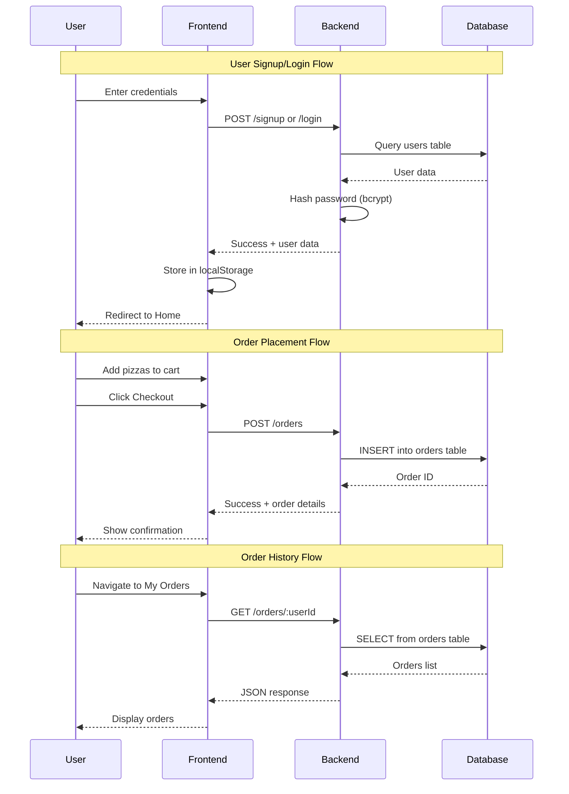
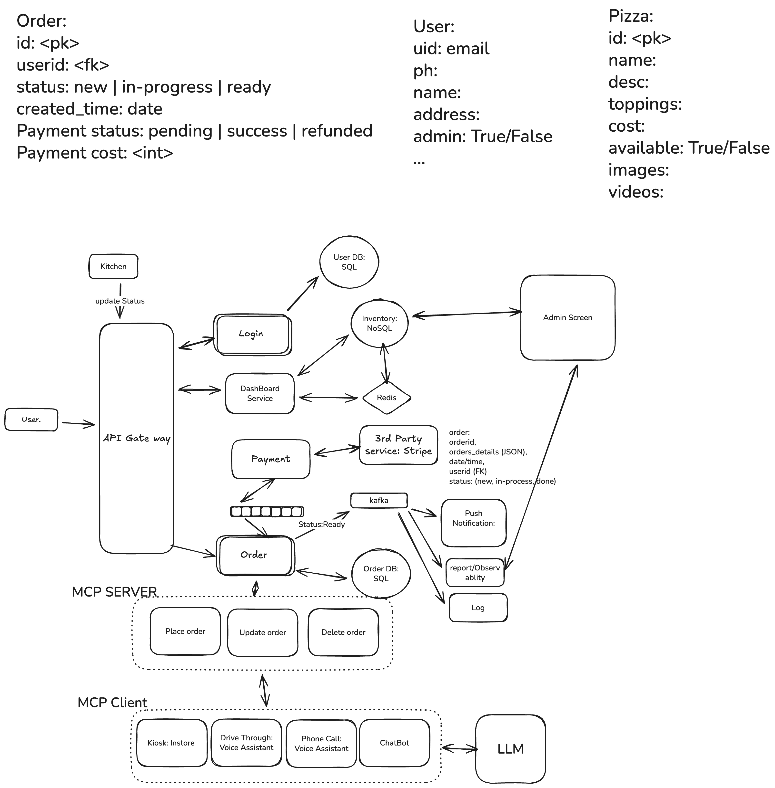

# 🍕 FlowFuse Pizza Ordering Application

A full-stack pizza ordering web application built with modern technologies and containerized using Docker. This application allows users to browse pizzas, add items to cart, place orders, and view order history.

---

## 📋 Table of Contents

- [System Architecture](#system-architecture)
- [Technologies Used](#technologies-used)
- [Features](#features)
- [Requirements](#requirements)
- [Setup and Running the Application](#setup-and-running-the-application)
- [Project Flow](#project-flow)
- [System Design Resources](#system-design-resources)
- [Database Schema](#database-schema)
- [API Endpoints](#api-endpoints)
- [Notes](#notes)
- [Future Enhancements](#future-enhancements)

---

## 🏗️ System Architecture

The application follows a three-tier architecture with containerized microservices:

```mermaid
graph TB
    subgraph "Client Layer"
        Browser[Web Browser]
    end
    
    subgraph "Docker Network - pizza_network"
        subgraph "Frontend Container"
            React[React + TypeScript]
            Nginx[Nginx Reverse Proxy]
        end
        
        subgraph "Backend Container"
            Fastify[Node.js + Fastify API]
        end
        
        subgraph "Database Container"
            MySQL[(MySQL 8.0)]
        end
    end
    
    Browser -->|HTTP :8080| Nginx
    Nginx -->|Serve Static Files| React
    Nginx -->|Proxy /api/*| Fastify
    Fastify -->|SQL Queries| MySQL
    
    style Browser fill:#e1f5ff
    style React fill:#61dafb
    style Nginx fill:#009639
    style Fastify fill:#000000
    style MySQL fill:#4479a1
```



### Data Flow Diagram



---

## 🛠️ Technologies Used

### Frontend
- **React** - UI library
- **TypeScript** - Type-safe JavaScript
- **Vite** - Build tool and dev server
- **Nginx** - Web server and reverse proxy

### Backend
- **Node.js 20** - JavaScript runtime
- **Fastify** - High-performance web framework
- **bcrypt** - Password hashing
- **mysql2** - MySQL database driver
- **@fastify/cors** - CORS middleware

### Database
- **MySQL 8.0** - Relational database
- **Docker Volumes** - Data persistence

### DevOps
- **Docker** - Containerization
- **Docker Compose** - Multi-container orchestration
- **Docker Hub** - Image registry (MySQL)

---

## ✨ Features

### User Features
- ✅ **User Authentication**
  - Sign up with name, email, and password
  - Login with email and password
  - Secure password hashing with bcrypt
  - Session management via localStorage

- ✅ **Pizza Menu**
  - Browse pizzas by category (Veg, Non-Veg, Special)
  - View pizza details (name, price)
  - Add pizzas to cart with quantity management

- ✅ **Shopping Cart**
  - Add/remove items
  - Adjust quantities
  - Real-time total calculation
  - Persistent cart state

- ✅ **Order Management**
  - Place orders with multiple items
  - View order confirmation with Order ID
  - View complete order history
  - See order details (items, quantities, total amount, date)

### Technical Features
- 🔒 **Route Protection** - Protected routes require authentication
- 🔄 **API Integration** - REST API communication between frontend and backend
- 📦 **Containerization** - Fully dockerized application
- 🌐 **Reverse Proxy** - Nginx handles routing and API proxying
- 💾 **Data Persistence** - MySQL with Docker volumes
- 🏥 **Health Checks** - Container health monitoring
- 📱 **Responsive Design** - Mobile-friendly UI

---

## 📦 Requirements

### Software Prerequisites
- **Docker Desktop** - Version 20.10 or higher
- **Docker Compose** - Version 2.0 or higher
- **Web Browser** - Modern browser (Chrome, Firefox, Safari, Edge)
- **Operating System** - macOS, Linux, or Windows with WSL2

### System Resources
- Minimum 2GB RAM available
- 5GB free disk space
- Port 8080 available on host machine

### Optional (for development)
- **Node.js** - Version 20.x LTS
- **npm** - Version 10.x or higher
- **Git** - For version control

---

## 🚀 Setup and Running the Application

### Quick Start (Recommended)

1. **Clone the Repository**
   ```bash
   git clone https://github.com/adithya1012/FlowFuse-Pizza-Ordering-App.git
   cd FlowFuse-Pizza-Ordering-App
   ```

2. **Start the Application**
   ```bash
   # Make the start script executable
   chmod +x start.sh
   
   # Start all services
   ./start.sh up
   ```

3. **Access the Application**
   
   Open your browser and navigate to:
   ```
   http://localhost:8080
   ```

4. **Create an Account**
   - Click "Sign Up"
   - Enter your name, email, and password
   - Login with your credentials

5. **Start Ordering**
   - Browse the pizza menu
   - Add items to cart
   - Proceed to checkout
   - View your order history in "My Orders"

### Manual Setup

If you prefer manual control:

```bash
# Step 1: Build all Docker images
docker-compose build

# Step 2: Start all services in detached mode
docker-compose up -d

# Step 3: Check service status
docker-compose ps

# Step 4: View logs (optional)
docker-compose logs -f

# Step 5: Access the application
# Open http://localhost:8080 in your browser
```

### Stopping the Application

```bash
# Stop all services
docker-compose down

# Stop and remove all data (WARNING: deletes database)
docker-compose down -v
```

### Useful Commands

```bash
# View logs for all services
docker-compose logs -f

# View logs for specific service
docker-compose logs -f frontend
docker-compose logs -f backend
docker-compose logs -f database

# Restart a specific service
docker-compose restart frontend

# Rebuild and restart after code changes
docker-compose up --build -d

# Check container status
docker-compose ps

# Execute commands in containers
docker exec -it pizza_backend sh
docker exec -it pizza_database mysql -u pizza_user -ppizza_password123 pizza_app_db
```

---

## 🔄 Project Flow

### High-Level User Journey

```
Landing Page (Login) 
    ↓
Sign Up / Login 
    ↓
Home (Pizza Menu) 
    ↓
Add to Cart 
    ↓
View Cart 
    ↓
Checkout 
    ↓
Order Confirmation 
    ↓
My Orders (History)
```

### Technical Flow

#### 1. **User Authentication Flow**
- **Frontend**: User enters credentials in Login/SignUp form
- **Backend**: Validates input, hashes password with bcrypt
- **Database**: Stores/retrieves user data from `users` table
- **Frontend**: Stores user data in localStorage, redirects to Home

#### 2. **Pizza Browsing Flow**
- **Frontend**: Loads pizza data from local JSON file
- **Frontend**: Displays pizzas grouped by category
- **Frontend**: User adds pizzas to cart (Context API state)

#### 3. **Order Placement Flow**
- **Frontend**: User clicks Checkout in Cart page
- **Frontend**: Sends POST request to `/api/orders` with cart data
- **Backend**: Validates order data and user authentication
- **Database**: Inserts order into `orders` table with JSON items
- **Backend**: Returns order ID and confirmation
- **Frontend**: Displays success message, clears cart

#### 4. **Order History Flow**
- **Frontend**: User clicks "My Orders" button
- **Frontend**: Sends GET request to `/api/orders/:userId`
- **Backend**: Queries database for user's orders
- **Database**: Returns orders sorted by date (newest first)
- **Backend**: Parses JSON items and formats response
- **Frontend**: Displays order cards with details

### Communication Details

| Flow | Frontend | Backend | Database |
|------|----------|---------|----------|
| **Signup** | POST /api/signup | Hash password, INSERT | users table |
| **Login** | POST /api/login | Verify password, SELECT | users table |
| **Place Order** | POST /api/orders | Validate & INSERT | orders table |
| **Get Orders** | GET /api/orders/:userId | SELECT & parse JSON | orders table |

---

## 🎥 System Design Resources

### System Design Recording

[](https://purdue0-my.sharepoint.com/:v:/g/personal/seesa01_purdue_edu/IQBwzrXL9VjeS5jYhG3AZaJ0ASeanGFpB3tlZtz27bUJ44A?nav=eyJyZWZlcnJhbEluZm8iOnsicmVmZXJyYWxBcHAiOiJTdHJlYW1XZWJBcHAiLCJyZWZlcnJhbFZpZXciOiJTaGFyZURpYWxvZy1MaW5rIiwicmVmZXJyYWxBcHBQbGF0Zm9ybSI6IldlYiIsInJlZmVycmFsTW9kZSI6InZpZXcifX0%3D&e=RFO1uE)


The system design video should cover:
- Overall architecture explanation
- Frontend, Backend, Database design decisions
- API design and data flow
- Containerization strategy
- Security considerations

### Production-Ready Architecture



The architecture diagram should illustrate:
- Multi-container Docker setup
- Network configuration
- Load balancing (if applicable)
- Database replication (if applicable)
- CDN integration (if applicable)
- Deployment pipeline

---

## 🗄️ Database Schema

### Users Table
```sql
CREATE TABLE users (
    id INT AUTO_INCREMENT PRIMARY KEY,
    name VARCHAR(255) NOT NULL,
    email VARCHAR(255) NOT NULL UNIQUE,
    password VARCHAR(255) NOT NULL,
    created_at TIMESTAMP DEFAULT CURRENT_TIMESTAMP,
    updated_at TIMESTAMP DEFAULT CURRENT_TIMESTAMP ON UPDATE CURRENT_TIMESTAMP,
    INDEX idx_email (email),
    INDEX idx_created_at (created_at)
);
```

### Orders Table
```sql
CREATE TABLE orders (
    order_id INT AUTO_INCREMENT PRIMARY KEY,
    user_id INT NOT NULL,
    items JSON NOT NULL,
    total_amount DECIMAL(10, 2) NOT NULL,
    created_at TIMESTAMP DEFAULT CURRENT_TIMESTAMP,
    INDEX idx_user_id (user_id),
    INDEX idx_order_created_at (created_at),
    CONSTRAINT chk_total_amount CHECK (total_amount >= 0)
);
```

### Sample Data

**Users Table:**
| id | name | email | password (hashed) |
|----|------|-------|-------------------|
| 1 | John Doe | john@example.com | $2b$10$... |

**Orders Table:**
| order_id | user_id | items (JSON) | total_amount | created_at |
|----------|---------|--------------|--------------|------------|
| 1 | 1 | [{"pizzaId":1,"name":"Margherita","cost":299,"quantity":2}] | 598.00 | 2026-01-28 10:30:00 |

---

## 🔌 API Endpoints

### Authentication

#### POST `/signup`
Register a new user

**Request Body:**
```json
{
  "name": "John Doe",
  "email": "john@example.com",
  "password": "securePassword123"
}
```

**Response:**
```json
{
  "success": true,
  "message": "User registered successfully",
  "data": {
    "id": 1,
    "name": "John Doe",
    "email": "john@example.com"
  }
}
```

#### POST `/login`
Authenticate existing user

**Request Body:**
```json
{
  "email": "john@example.com",
  "password": "securePassword123"
}
```

**Response:**
```json
{
  "success": true,
  "message": "Login successful",
  "data": {
    "id": 1,
    "name": "John Doe",
    "email": "john@example.com"
  }
}
```

### Orders

#### POST `/orders`
Place a new order

**Request Body:**
```json
{
  "userId": 1,
  "items": [
    {
      "pizzaId": 1,
      "name": "Margherita",
      "cost": 299,
      "quantity": 2
    }
  ],
  "totalAmount": 598
}
```

**Response:**
```json
{
  "success": true,
  "message": "Order placed successfully",
  "order": {
    "orderId": 1,
    "userId": 1,
    "items": [...],
    "totalAmount": 598,
    "createdAt": "2026-01-28T10:30:00.000Z"
  }
}
```

#### GET `/orders/:userId`
Retrieve all orders for a user

**Response:**
```json
{
  "success": true,
  "userId": 1,
  "orders": [
    {
      "orderId": 1,
      "items": [...],
      "totalAmount": 598,
      "createdAt": "2026-01-28T10:30:00.000Z"
    }
  ]
}
```

---

## 🚀 Future Enhancements

### Phase 1: Security & Authentication
- [ ] Implement JWT-based authentication with refresh tokens
- [ ] Add session timeout and auto-logout
- [ ] Implement password reset via email
- [ ] Add two-factor authentication (2FA)
- [ ] Rate limiting for API endpoints

### Phase 2: Payment Integration
- [ ] Integrate Stripe/PayPal for payment processing
- [ ] Add payment status tracking
- [ ] Implement refund functionality
- [ ] Support multiple payment methods

### Phase 3: Order Management
- [ ] Real-time order status updates (Preparing, Out for Delivery, Delivered)
- [ ] Order tracking with map integration
- [ ] Order cancellation within time window
- [ ] Order reordering functionality
- [ ] Email/SMS notifications for order updates

### Phase 4: Admin Dashboard
- [ ] Admin login and dashboard
- [ ] Order management interface
- [ ] Pizza menu management (CRUD operations)
- [ ] User management
- [ ] Sales analytics and reports
- [ ] Inventory management

### Phase 5: Enhanced Features
- [ ] Pizza customization (toppings, size, crust)
- [ ] Promo codes and discounts
- [ ] Loyalty program and rewards
- [ ] User reviews and ratings
- [ ] Favorites and saved addresses
- [ ] Multiple delivery addresses per user

### Phase 6: Performance & Scalability
- [ ] Implement caching (Redis)
- [ ] Database query optimization and indexing
- [ ] CDN for static assets
- [ ] Load balancing for backend
- [ ] Database replication for read scaling
- [ ] Implement message queue for async processing

### Phase 7: DevOps & Monitoring
- [ ] CI/CD pipeline (GitHub Actions)
- [ ] Automated testing (unit, integration, e2e)
- [ ] Application monitoring (Prometheus, Grafana)
- [ ] Error tracking (Sentry)
- [ ] Log aggregation (ELK stack)
- [ ] Automated backups

---

## 📄 License

This project is created for educational purposes.

---

## 👨‍💻 Author

**Adithya**
- GitHub: [@adithya1012](https://github.com/adithya1012)
- Repository: [FlowFuse-Pizza-Ordering-App](https://github.com/adithya1012/FlowFuse-Pizza-Ordering-App)

---

## 🙏 Acknowledgments

- React team for the amazing UI library
- Fastify team for the high-performance web framework
- Docker team for containerization platform
- MySQL team for the reliable database system

---

**Built with ❤️ using React, Node.js, and Docker**
